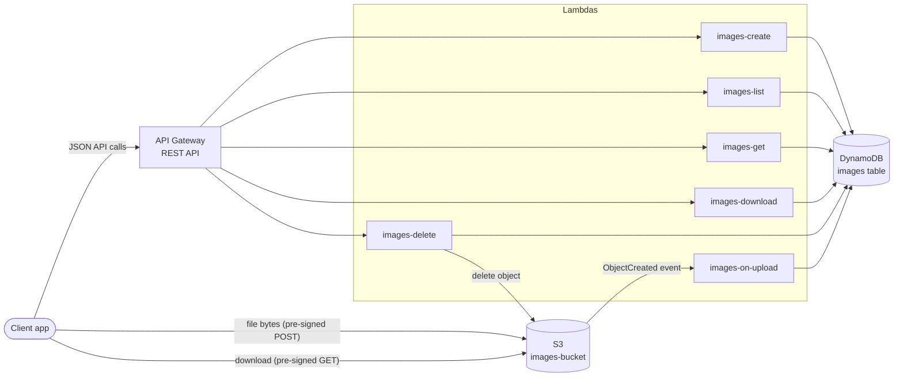
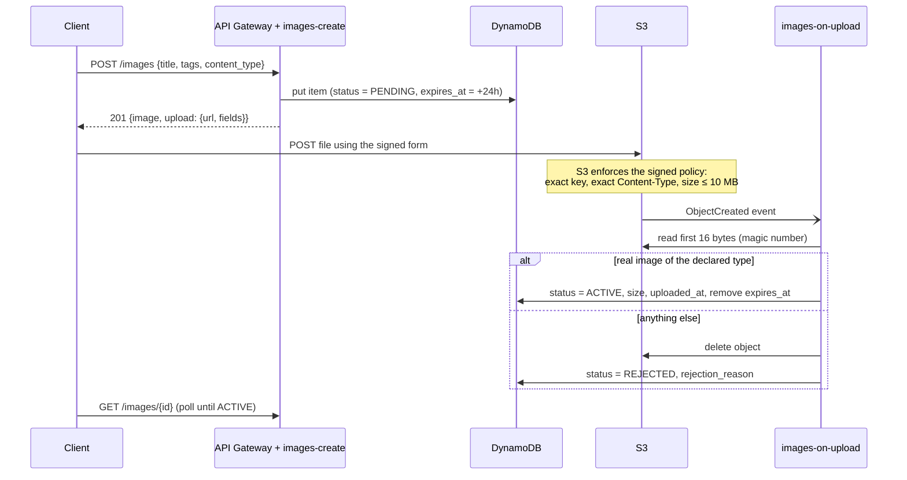
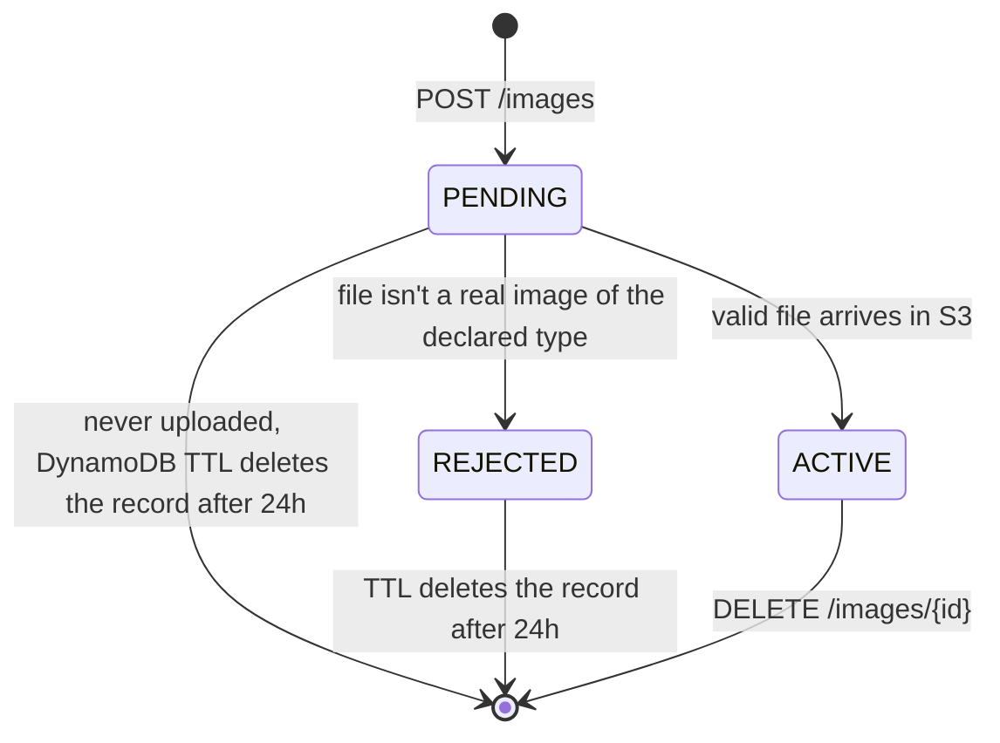

# Image Service — Design

This document explains how the service works and, more importantly, *why* it is built this way. If you only read one section, read S3 (how uploads work) and §5 (the DynamoDB schema).

## 1. What we are building

The service lets users upload images with metadata, list and search them, view or download them, and delete their own. It must handle many concurrent users, so every component has to scale horizontally without us managing servers. The team's stack is fixed: API Gateway, Lambda, S3 and DynamoDB, with Python and LocalStack for local development.

## 2. Architecture at a glance (Approach - 2)




The key idea in this picture: **image bytes never flow through API Gateway or Lambda.** The API only handles small JSON metadata; the heavy traffic goes directly between the client and S3.

## 3. The most important decision: how bytes get into S3

There are two common ways to build "upload image with metadata":


|                   | A. Send the file through the API (multipart to Lambda)                                                   | B. Pre-signed URL, client uploads straight to S3 (**chosen**)      |
| ----------------- | -------------------------------------------------------------------------------------------------------- | ------------------------------------------------------------------ |
| Max file size     | API Gateway caps requests at 10 MB and Lambda at 6 MB; base64 encoding adds ~33%, so ~4.4 MB in practice | Up to 5 GB per single upload; we enforce 10 MB by policy           |
| Data path         | Client → API Gateway → Lambda → S3                                                                       | Client → S3, one hop                                               |
| Lambda work       | Every upload is decoded and written to S3 by a Lambda, occupying an execution slot while it does         | Lambda runs for a few milliseconds to sign a URL                   |
| Client experience | One request; image visible immediately                                                                   | Two requests, then the image becomes `ACTIVE` about a second later |
| Validation        | File checked before anything is stored                                                                   | File checked right after it lands in S3; invalid files are deleted |
| Complexity        | One request, no lifecycle                                                                                | Two steps plus an S3 trigger and a `PENDING` → `ACTIVE` lifecycle  |


Option B is the standard pattern for scalable uploads on AWS: upload traffic is the heaviest traffic in an image app, and B keeps it entirely out of our compute layer. Its costs are a two-step client flow (the README gives ready-made curl and Postman steps) and a small lifecycle. Option A is simpler for clients, and would be a reasonable addition later as a convenience endpoint for small images.

The upload works like this:




We use a **pre-signed POST** rather than a pre-signed PUT because a POST policy lets S3 itself reject files that are too large or of the wrong type, before we store (or pay for) a single byte. Completion is detected by an **S3 event**, not by asking the client to call "I'm done", because a client can forget, crash or lie; S3 cannot.

## 4. Image lifecycle




Only `ACTIVE` images appear in listings or can be downloaded. `PENDING` and `REJECTED` records carry an `expires_at` attribute, and DynamoDB's built-in TTL removes them automatically, so abandoned uploads clean themselves up with no cron job.

## 5. Data model (DynamoDB)


### 5.1 Table `images`

One item per image. The partition key is a random UUID, which spreads items evenly across DynamoDB partitions no matter how many images we store.


| Attribute          | Type     | Example                                       | Notes                                                                      |
| ------------------ | -------- | --------------------------------------------- | -------------------------------------------------------------------------- |
| `image_id`         | S        | `3f1c2b9a-0c1d-4e5f-8a9b-0c1d2e3f4a5b`        | **Partition key.** UUID4, generated server-side                            |
| `user_id`          | S        | `alice`                                       | Owner. GSI key                                                             |
| `title`            | S        | `F1`                                          | Required, ≤ 100 chars                                                      |
| `description`      | S        | `Monza, 2026`                                 | Optional, ≤ 1000 chars                                                     |
| `tags`             | L (of S) | `["mclaren", "f1"]`                           | Optional, ≤ 10, lowercase `[a-z0-9_]`                                      |
| `content_type`     | S        | `image/jpeg`                                  | One of jpeg, png, gif, webp                                                |
| `s3_key`           | S        | `images/3f1c…4a5b.jpg`                        | Internal; never returned to clients                                        |
| `status`           | S        | `ACTIVE`                                      | `PENDING` / `ACTIVE` / `REJECTED`. GSI key                                 |
| `created_at`       | S        | `2026-09-11T10:15:30.123456Z`                 | ISO-8601 UTC, fixed width, so string order equals time order. GSI sort key |
| `uploaded_at`      | S        | `2026-09-11T10:15:32.004511Z`                 | Set when the file is verified                                              |
| `size_bytes`       | N        | `2483921`                                     | Set when the file is verified                                              |
| `rejection_reason` | S        | `File content is not a valid image/png image` | Only on `REJECTED`                                                         |
| `expires_at`       | N        | `1789215330`                                  | **TTL attribute** (epoch seconds); present only while not `ACTIVE`         |


Example `ACTIVE` item:

```json
{
  "image_id": "3f1c2b9a-0c1d-4e5f-8a9b-0c1d2e3f4a5b",
  "user_id": "alice",
  "title": "F1",
  "description": "Monza, 2026",
  "tags": ["mclaren", "f1"],
  "content_type": "image/jpeg",
  "s3_key": "images/3f1c2b9a-0c1d-4e5f-8a9b-0c1d2e3f4a5b.jpg",
  "status": "ACTIVE",
  "created_at": "2026-09-11T10:15:30.123456Z",
  "uploaded_at": "2026-09-11T10:15:32.004511Z",
  "size_bytes": 2483921
}
```


### 5.2 Indexes


| Index                          | Partition key | Sort key     | Projection | Answers                           |
| ------------------------------ | ------------- | ------------ | ---------- | --------------------------------- |
| Table                          | `image_id`    | —            | —          | "Get / update / delete image X"   |
| GSI `status-created_at-index`  | `status`      | `created_at` | ALL        | "All ACTIVE images, newest first" |
| GSI `user_id-created_at-index` | `user_id`     | `created_at` | ALL        | "Alice's images, newest first"    |


Both GSIs project all attributes so a listing is a single Query with no follow-up reads. Metadata items are small (well under 1 KB), so the extra storage is cheap.

### 5.3 Access patterns

Designing DynamoDB starts from the queries, not the entities. Every API operation maps to exactly one efficient DynamoDB operation; none of them Scans the table.


| API call                        | DynamoDB operation                                                        |
| ------------------------------- | ------------------------------------------------------------------------- |
| `POST /images`                  | `PutItem` with `attribute_not_exists(image_id)`                           |
| S3 upload event                 | `GetItem`, then `UpdateItem` with `attribute_exists(image_id)`            |
| `GET /images`                   | `Query` status GSI, `status = ACTIVE`, descending                         |
| `GET /images?user_id=alice`     | `Query` user GSI, `user_id = alice`, filter `status = ACTIVE`, descending |
| `GET /images?tag=f1`            | Either query above plus filter `contains(tags, "f1")`                     |
| `GET /images/{id}`, `/download` | `GetItem` (strongly consistent)                                           |
| `DELETE /images/{id}`           | `GetItem` (ownership check), then `DeleteItem`                            |


## 6. Listing: filters and pagination

The list endpoint supports two filters, which can be combined. `user_id` is served by its own index, so it only ever reads that user's items; its cost is proportional to the page size. `tag` is applied as a DynamoDB `FilterExpression` on top of whichever query runs. A filter is evaluated *after* items are read, so a rare tag means reading more items to fill a page. That is fine at this scale and keeps the design simple; §7 explains what to do at Instagram scale.

Because DynamoDB applies `Limit` before the filter, a naive implementation returns short or even empty pages. The repository instead keeps reading until the page is full, then returns the key of the last item it actually returned as the resume point, so clients always get full pages. A cap of 10 reads per request bounds the work any single call can do; if it's reached, the client simply gets a shorter page with a `next_token`.

Pagination uses opaque `next_token` strings, which are URL-safe base64 of DynamoDB's `LastEvaluatedKey`. The server validates that a token has exactly the key shape for the current query, so a token from a different filter combination is rejected with 400 instead of producing strange results. Results are always newest first.

## 7. How it scales

**API Gateway and Lambda** scale automatically per request. Since Lambdas only handle metadata, each call finishes in milliseconds, so a modest concurrency limit serves a very large request rate. **S3** carries all the heavy traffic and scales per key prefix automatically; random UUIDs in keys spread load well. **DynamoDB** runs in on-demand mode, so capacity follows traffic without planning; the random `image_id` partition key avoids hot partitions on the base table. Pre-signed URLs cost nothing to generate (they're computed locally, not fetched), so including a download URL on every listed item is free.

The first bottleneck at very large scale is the **status GSI**: every active image lives under the single partition value `ACTIVE`, and one partition accepts roughly 1,000 writes per second. The fix is write sharding: store `ACTIVE#0` … `ACTIVE#9` (e.g. hash of `image_id` mod 10) and have the global listing query the shards in parallel and merge by `created_at`. The second is **tag search**, which should move to a dedicated index at scale: either a separate `image_tags` table keyed by `tag` + `created_at` (written in the same transaction as the image), or DynamoDB Streams feeding OpenSearch for full-text and multi-tag search. For downloads, putting **CloudFront** in front of S3 would add edge caching; signed CloudFront URLs replace S3 pre-signed URLs.

## 8. Reliability and failure handling


| Situation                                                     | What happens                                                                                                                                                                                                  |
| ------------------------------------------------------------- | ------------------------------------------------------------------------------------------------------------------------------------------------------------------------------------------------------------- |
| Client gets an upload form but never uploads                  | Record stays `PENDING` (hidden from lists) and TTL deletes it after 24h                                                                                                                                       |
| Client uploads something that isn't a real image              | Trigger detects it via magic bytes, deletes the object, marks `REJECTED`                                                                                                                                      |
| S3 delivers the same event twice                              | Processing is idempotent; the second run produces the same end state                                                                                                                                          |
| Upload arrives after the image was deleted (form still valid) | Trigger finds no record and deletes the orphaned object                                                                                                                                                       |
| DynamoDB throttles during the upload trigger                  | The exception propagates, and Lambda retries the async S3 event automatically                                                                                                                                 |
| `DELETE` fails halfway                                        | The file is deleted first, then the metadata. If the second step fails the image still shows, and retrying the `DELETE` finishes the job. The opposite order could leave an invisible file we pay for forever |
| Any unexpected error in an API handler                        | Logged with stack trace; client gets a generic `500 INTERNAL_ERROR` with no internals leaked                                                                                                                  |


## 9. Security

**Identity.** Each request's user comes from a Cognito authorizer on API Gateway in production (the JWT `sub` claim, read from `requestContext.authorizer.claims`). For local development an `X-User-Id` header stands in, but only when `ALLOW_HEADER_AUTH=true`. It is off by default because it's trivially spoofable.

**Authorization.** Only an image's owner can delete it (403 otherwise). Listing and viewing are public, matching Instagram-style public profiles.

**Private bucket.** The bucket is never public. Clients only get short-lived pre-signed URLs: 15 minutes to upload, 5 minutes to download.

**Upload constraints.** These are enforced by S3 through the signed policy (exact key, content type and size limit), and the file content is then verified with magic-number sniffing, because a declared `Content-Type` alone proves nothing.

**Input validation.** Every field is validated with strict length and character rules; unknown fields are rejected so typos surface immediately.

**Least privilege.** The deploy script documents the minimal IAM permissions. In real AWS each function would get its own role; for example, the list function needs only `dynamodb:Query`.

## 10. Code structure

The code is layered so each file has one job and can be understood (and tested) on its own:

```
handlers.py     HTTP in / HTTP out. One function per route. No business rules.
   │
service.py      Business rules: lifecycle, ownership, verification. Reads like the spec.
   │
   ├── repository.py   Everything DynamoDB: keys, indexes, conditions, pagination.
   └── storage.py      Everything S3: pre-signed forms/URLs, reads, deletes.

validation.py   Pure input rules      models.py   The Image record
schema.py       Table + index layout  apigw.py    Event parsing & responses
errors.py       Errors that map to HTTP status codes
```

We deploy **one Lambda per route**, all from the same small package. Each function can then get its own IAM permissions, memory, timeout and alarms, and a slow endpoint can't eat another's concurrency. The alternative (one Lambda with an internal router) is also reasonable; it has fewer cold starts, but it gives up per-route isolation.

## 11. What I would add before production

Next I would add infrastructure as code (AWS SAM or CDK) replacing the LocalStack deploy script, with per-function IAM roles; a Cognito user pool and authorizer, then turn off header auth; CloudWatch alarms on Lambda errors, throttles and the upload trigger's failure destination (an SQS dead-letter queue for events that fail all retries); API Gateway throttling and usage plans per client; and asynchronous thumbnail generation triggered by the same S3 event. Beyond that, the scale steps in §7 (GSI write sharding, a real tag index, CloudFront) apply once traffic justifies them.